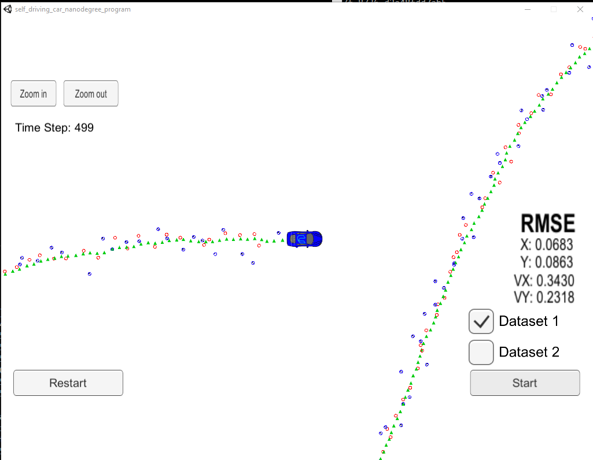
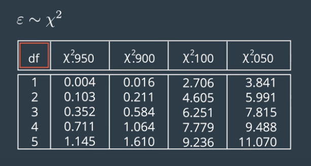
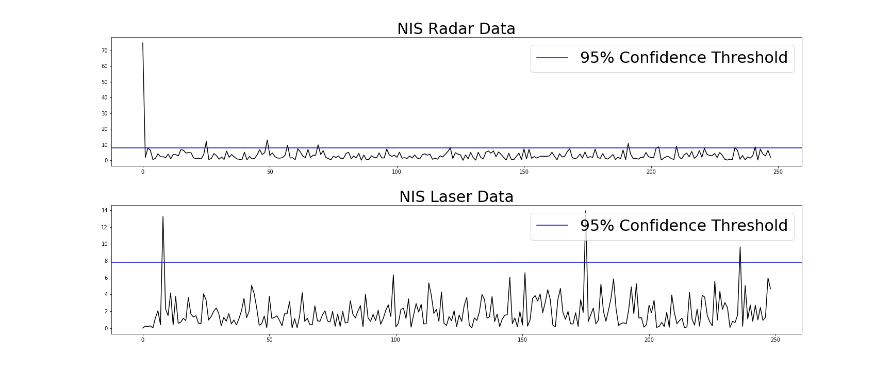

# Unscented Kalman Filter Project 
## Self-Driving Car Engineer Nanodegree Program

### Tom Chmielenski
#### January 2018

----

In this project, I implemented a unscented kalman filter to estimate the state of a moving object of interest with noisy lidar and radar measurements. Passing the project required obtaining RMSE values of that are lower that the tolerance outlined in the project rubric [0.09, 0.10, 0.40, 0.30] . 

---

## Dataset 1 Results

----

## Dataset 1 NIS Results

Using the Chi Squared Distribution above, we see our three-dimensional radar measurement has a 95% confidence level with a value of 7.815, and our two-dimensional lidar measurement has a 95% confidence level of 5.991

Use a python notebook ("./NIS Output.ipynb"), I plotted the Normalized Innovation Squared (NIS) values to verify the process noise settings.

